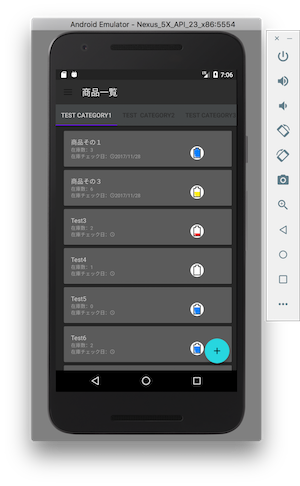
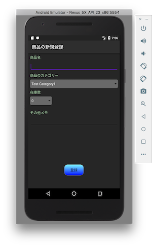
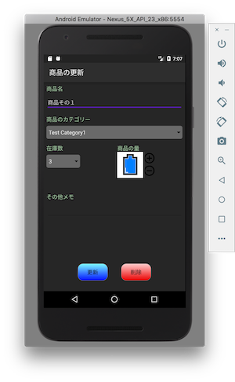
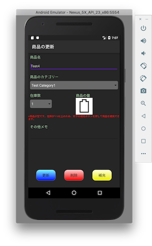
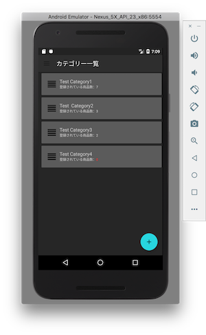
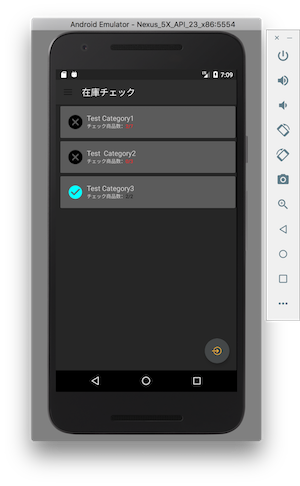

# GMApp
このアプリは友人に依頼されて作成し、途中で頓挫した商品管理（主に飲料）のアプリです。  
APIでのやり取りや、その他ネットワーク通信は一切ありません。手動で商品登録して管理します。  
主な機能は以下のとおりです。  
  - 登録商品のカテゴリー別一覧表示機能
  - 商品の在庫数と残量表示機能
  - 在庫チェック機能

# このアプリ作成の経緯
Androidでアプリを作成するのはこれで2回目となります。1回目は2015年秋に、資格勉強のモチベージョン維持のため完全な自分用アプリとして作成しました。  
時間がなくモバイルアプリの開発経験がなかったため、設計は皆無、マテリアルデザイン等々も全て無視した作りにしていました。  

その際、Androidアプリでの設計やデザインはどう考えれば良いのか、という疑問を持った状態で最初のアプリ開発は終了しました。  

それから半年ほどして、友人から「こんなアプリあったら嬉しいな」と話を受けたことをきっかけに、余暇を使って本アプリを作成することにしました。  

３ヶ月ほど色々やりとりしたものの、結局本当に必要だったものはアプリではなかったこと、私の業務が多忙になりアプリに割ける時間がなくなってしまったことから  
このアプリは使われることなく消滅しました。  

ただ、本アプリで培った経験や反省点を踏まえ、次のアプリ「comlis-android-app」に取り組むことができたため無駄ではなかったと思っています。  

一部理解しないままコピーしたコードや作り自体が微妙であること、マテリアルデザインに沿っていない画面など色々な点で納得がいっていなかったこともあり  
Githubにあげる予定はありませんでしたが、諸事情により上げました。

# SDK version
  - min_sdk_version: 19
  - target_sdk_version: 23

# 主な画面と機能について
このアプリで提供している主な機能と画面です。  

## 商品の一覧
商品一覧画面です。初回で使用する場合はカテゴリーを1つ以上登録する必要があります。  
カテゴリーはカテゴリー一覧から登録できます。カテゴリー一覧は左上のハンバーガーメニューから遷移できます。  
なお、1つも商品が登録されていないカテゴリーはこの一覧に表示されません。  

## 商品の登録/更新/削除
商品一覧画面にて、右下のfabをタップすると商品の登録画面を表示します。  

商品一覧画面にて、商品をタップすると該当商品の更新画面を表示します。  
商品の削除は更新画面から行います。また、右の画面イメージの通り、残量がなくなりかつ在庫数が1以上ある場合は補充ボタンが表示されます。  
  

## カテゴリー一覧
商品をカテゴライズするための項目一覧です。  
カテゴリーの並び順がそのまま商品一覧のタブの表示順になります。  
並び順を変更する場合は各アイテムの左にある4つ線のアイコンをタップしながら上下に移動します。  

## 在庫チェック
在庫チェックを行う画面です。  

在庫チェックを行う手順は以下のとおりです。  
1. チェック対象のカテゴリーをタップし在庫を確認します。
2. 在庫を確認した商品の×をタップするとチェックマークに切り替わります。
3. 画面を戻ると「チェック商品数」にチェックマークをつけた数が反映されます。
4. 問題がなければ右下のfabをタップし「在庫の確定確認」を行います。
